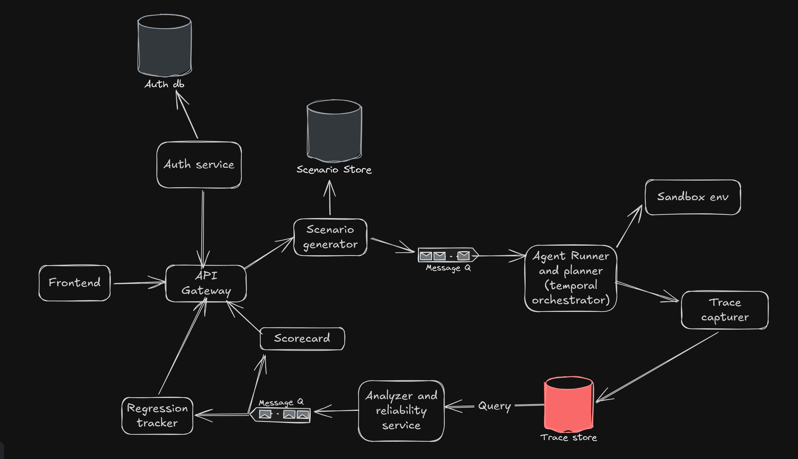

# Relib — Agent Reliability Engine

A CI/CD-style reliability engine for autonomous AI agents: generate adversarial scenarios, run agents in a sandboxed environment, capture traces, classify failures, score reliability, and track regressions across versions.

## Problem

Autonomous AI agents fail in ways conventional software tests do not capture. A single bad LLM decision can cascade into destructive real-world actions, and the failure is rarely reproducible by re-running a unit test. Recurring failure classes include:

| Failure mode | Description |
|---|---|
| Unsafe destructive actions | The agent deletes, overwrites, or mutates state without verification or confirmation. |
| Tool call loops | The agent repeats identical tool invocations, ignoring unchanged results. |
| Goal drift | The agent abandons the assigned objective mid-run and optimizes something else. |
| Hallucinated confidence | The agent asserts facts ("verified", "confirmed") it never actually checked. |
| Reliability regressions | A prompt or model change silently degrades behavior that used to pass. |

Today there is no practical equivalent of a CI pipeline that catches these issues before an agent reaches production.

## Solution

Relib treats agent evaluation like continuous integration:

1. **Adversarial scenario generation** — from the agent's system prompt and tool definitions, an LLM-driven generator produces targeted attack scenarios.
2. **Sandboxed execution** — scenarios are queued and executed against the agent inside an isolated sandbox with mocked external tools.
3. **Trace capture** — every LLM call, tool call, argument, result, and latency is persisted step-by-step.
4. **Failure analysis** — traces are evaluated against a rule-based failure taxonomy with optional LLM-assisted explanations.
5. **Scorecards** — each run receives a point-in-time reliability score.
6. **Regression tracking** — scores are compared across agent versions and commits so degradations surface immediately.

Everything is event-driven: services communicate through Kafka topics and dedicated PostgreSQL stores rather than synchronous calls.

## Architecture



The system consists of isolated services behind a Kong API Gateway, which is the only entry point for the frontend:

- **API Gateway (Kong)** — declaratively configured (`gateway/kong.yml`); routes `/api/auth`, `/api/scenarios`, `/api/scorecards`, `/api/regressions` to the corresponding service.
- **Scenario Generator** — ingests agent prompts/tools, writes adversarial scenarios to the Scenario Store, and publishes jobs to Kafka topic `scenario-jobs`.
- **Agent Runner & Planner (Temporal)** — consumes `scenario-jobs`, orchestrates execution as Temporal workflows with timeouts and retries.
- **Sandbox Env** — executes the agent against deterministic mocked tools (including intentionally destructive ones such as `delete_deployment`).
- **Trace Capturer** — streams every execution step into the Trace Store.
- **Analyzer & Reliability Service** — queries the Trace Store, classifies failure modes, computes reliability scores, and publishes results to Kafka topic `analysis-events`.
- **Scorecard Service** — consumes `analysis-events` and aggregates point-in-time scorecards.
- **Regression Tracker** — also consumes `analysis-events`; compares scores across versions/commits and records deltas and regression status.
- **Frontend dashboard** — Next.js application rendering the overview, evaluations, traces, scorecards, regressions, and a Run Evaluation flow exclusively through Kong.

Data flows left-to-right through the queue boundaries above; no service bypasses the message queues, and the browser never reaches a backend directly.

## Key Features

- Adversarial scenario generation driven by the agent's own prompt and tool surface
- Kafka-based asynchronous decoupling between generation, execution, and reporting
- Temporal orchestration of agent runs (retries, timeouts, workflow state)
- Sandboxed execution with mocked tools and safe failure injection
- Step-by-step trace capture and persistence (LLM calls, tool args/results, latency)
- Failure-mode analysis: unsafe destructive actions, tool loops, goal drift, hallucinated confidence, timeouts
- Reliability scorecards with pass/fail and severity classification
- Regression tracking across agent versions and commits (score delta, failure delta, status)
- Event-driven fan-out: one analysis event feeds both scorecards and regressions
- Dark developer-facing dashboard with trend charts and a trace timeline

## Tech Stack

| Layer | Technology |
|---|---|
| Services | Python, FastAPI, SQLAlchemy |
| Frontend | Next.js, React, TypeScript |
| Datastores | PostgreSQL (separate logical databases per concern) |
| Messaging | Apache Kafka (topics `scenario-jobs`, `analysis-events`) |
| Orchestration | Temporal |
| Gateway | Kong (DB-less, declarative `kong.yml`) |
| LLM integration | LangChain + Groq (deterministic mock mode for offline runs) |
| Tracing hooks | OpenTelemetry-compatible span metadata captured in traces (Jaeger-ready) |
| Local infrastructure | Docker Compose |

## Project Structure

```
├── ARCHITECTURE.md            # architecture directives and component map
├── docker-compose.yml         # Kafka, PostgreSQL stores, Temporal, Kong
├── gateway/
│   └── kong.yml               # declarative gateway configuration
├── services/
│   ├── auth/                  # auth DB schema (service layer pending)
│   ├── scenario-generator/    # adversarial scenario generation API
│   ├── agent-runner/          # Kafka consumer, Temporal workflows, sandbox, trace capturer
│   ├── analyzer/              # trace analysis, scoring, event publishing
│   ├── scorecard/             # scorecard consumer + query API
│   └── regression-tracker/    # regression consumer + query API
├── frontend/                  # Next.js reliability dashboard
└── docs/
    └── arc.png                # architecture diagram
```

## Running Locally

### Prerequisites

- Docker & Docker Compose
- Node.js 18+
- Python 3.11+

### 1. Clone and start infrastructure

```bash
git clone git@github.com:Gov-10/relibEngine.git
cd relibEngine
docker compose up -d
```

This starts:

| Container | Purpose | Host port |
|---|---|---|
| `message-queue` | Apache Kafka (KRaft) | 9092 |
| `auth-db` | PostgreSQL — Auth DB | 15432 |
| `scenario-store` | PostgreSQL — Scenario Store | 15433 |
| `trace-store` | PostgreSQL — Trace Store server | 15434 |
| `temporal` (+ UI) | Workflow engine | 7233 (UI: 8088) |
| `gateway` | Kong API Gateway | 8000 (admin: 8001) |

The `message-queue-init` container creates both topics (`scenario-jobs`, `analysis-events`) automatically. No other initialization containers are required.

### 2. Install service dependencies

```bash
python3 -m venv .venv
source .venv/bin/activate
pip install -r services/scenario-generator/requirements.txt \
              services/agent-runner/requirements.txt \
              services/analyzer/requirements.txt \
              services/scorecard/requirements.txt \
              services/regression-tracker/requirements.txt
```

Initialize the schemas that are not auto-created on startup:

```bash
python services/auth/init_db.py          # Auth DB tables
python services/agent-runner/init_db.py  # Trace Store tables (runs, trace_steps)
```

Scenario Store tables are created when the Scenario Generator starts; Scorecard and Regression Tracker create their own logical databases on first launch.

### 3. Start the backend services

Each service runs on the host; Kong proxies to them via `host.docker.internal`.

```bash
# Terminal 1 — Scenario Generator (mock mode; no API key needed)
SCENARIO_GENERATOR_MOCK=1 uvicorn main:app --host 0.0.0.0 --port 8102 --app-dir services/scenario-generator

# Terminal 2 — Agent Runner Temporal worker
python services/agent-runner/worker.py

# Terminal 3 — Agent Runner Kafka consumer (starts workflows from scenario-jobs)
python services/agent-runner/consumer.py

# Terminal 4 — Analyzer API (triggers analysis + publishes analysis-events)
uvicorn main:app --host 0.0.0.0 --port 8105 --app-dir services/analyzer

# Terminal 5 — Scorecard consumer + API
python services/scorecard/consumer.py &
uvicorn main:app --host 0.0.0.0 --port 8103 --app-dir services/scorecard

# Terminal 6 — Regression Tracker consumer + API
python services/regression-tracker/consumer.py &
uvicorn main:app --host 0.0.0.0 --port 8104 --app-dir services/regression-tracker
```

Verify the gateway wiring:

```bash
curl http://localhost:8000/api/scenarios/healthz
curl http://localhost:8000/api/scorecards/healthz
curl http://localhost:8000/api/regressions/healthz
```

### 4. Start the frontend

```bash
cd frontend
npm install
npm run dev        # development, or:
npm run build && npm start   # production build
```

Open **http://localhost:3000**.

### Environment variables

All variables are optional; sensible defaults are built in.

| Variable | Used by | Default |
|---|---|---|
| `SCENARIO_GENERATOR_MOCK` | Scenario Generator | unset — set to `1` for offline demo mode |
| `GROQ_API_KEY` | Scenario Generator, Analyzer explanations | unset |
| `GROQ_MODEL` | LLM calls | `llama-3.3-70b-versatile` |
| `NEXT_PUBLIC_API_BASE_URL` | Frontend | `http://localhost:8000` |
| `TEMPORAL_ADDRESS` / `TEMPORAL_NAMESPACE` / `TEMPORAL_TASK_QUEUE` | Agent Runner | `localhost:7233` / `relib-engine` / `scenario-execution` |
| `KAFKA_BOOTSTRAP_SERVERS` | consumers/publishers | `localhost:9092` |
| `ANALYSIS_EVENTS_TOPIC` / `SCENARIO_JOBS_TOPIC` | consumers/publishers | `analysis-events` / `scenario-jobs` |
| `TRACE_DATABASE_URL`, `SCENARIO_DATABASE_URL` | respective services | local Docker Compose DSNs |
| `SCORECARD_SERVER_URL` / `REGRESSION_SERVER_URL` (+ `_DB_NAME`) | reporting services | local Docker Compose DSNs |

## Usage / Demo Flow

1. Open the dashboard at `http://localhost:3000` and go to **Run Evaluation**.
2. Submit an agent name, system prompt, and tool list. The browser calls `POST /api/scenarios/generate` **through Kong**, which persists generated adversarial scenarios and queues jobs on Kafka (`scenario-jobs`). The UI shows each job's queued state.
3. The **Agent Runner** consumer picks up the job and starts a Temporal workflow; the **Sandbox Env** executes the mocked agent tools while the **Trace Capturer** writes each step to the Trace Store.
4. Trigger analysis via the Analyzer API:

   ```bash
   curl -X POST http://localhost:8105/analysis/runs/<run_id> \
     -H 'Content-Type: application/json' -d '{"agent_name": "deploy-agent"}'
   ```

   The Analyzer reads the trace, classifies failures, computes a reliability score, and publishes an `analysis-events` message.
5. Both downstream workers react independently: the **Scorecard Service** stores a point-in-time scorecard and the **Regression Tracker** computes score/failure deltas against the previous version.
6. The dashboard views (**Overview**, **Scorecards**, **Regressions**) read live data back through Kong; **Evaluations** and **Trace Explorer** render representative demo datasets for the internal-only flows.

## Current Status

This is a **hackathon prototype** built end-to-end around the target architecture.

Implemented and demonstrated working:

- Docker Compose infrastructure: Kafka, four PostgreSQL-backed stores, Temporal, Kong
- Scenario generation (Groq LLM or deterministic mock), Scenario Store persistence, Kafka publishing
- Agent Runner with Temporal workflows, sandboxed mock-tool execution, failure injection, trace persistence
- Rule-based failure taxonomy classification with reliability scoring and `analysis-events` fan-out
- Scorecard and regression services with idempotent consumption, replay safety, and query APIs
- Kong gateway with health-checked upstreams and CORS for the dashboard origin
- Next.js dashboard consuming the gateway, including a live Run Evaluation flow

Intentionally simplified:

- Sandbox tools are deterministic mocks rather than real Kubernetes/cloud APIs
- Analysis is rule-based; LLM explanations are opt-in via `ANALYZER_EXPLANATIONS`
- Evaluation and trace detail views use isolated demo data (those flows have no HTTP APIs by design)
- Auth service has a database schema but no HTTP layer yet; `/api/auth/*` returns 503 at the gateway
- Single-node Kafka/Temporal; no multi-tenant hardening or production secrets management

## Future Scope

- Integration with autonomous coding agents (e.g., Claude Code) as evaluation targets
- CI/CD reliability gates: block deploys when regression thresholds trip
- Deterministic replay of historical traces against new prompts/models
- Stronger sandbox isolation (gVisor/Firecracker-class boundaries instead of mocks)
- Expanded failure taxonomy beyond the initial five failure modes
- Packaging Relib as a reusable developer tool/SDK for agent teams

## License / Disclaimer

No license has been selected yet; all rights remain with the repository owner until one is added. This is a hackathon prototype — do not run it against production systems or real infrastructure.
